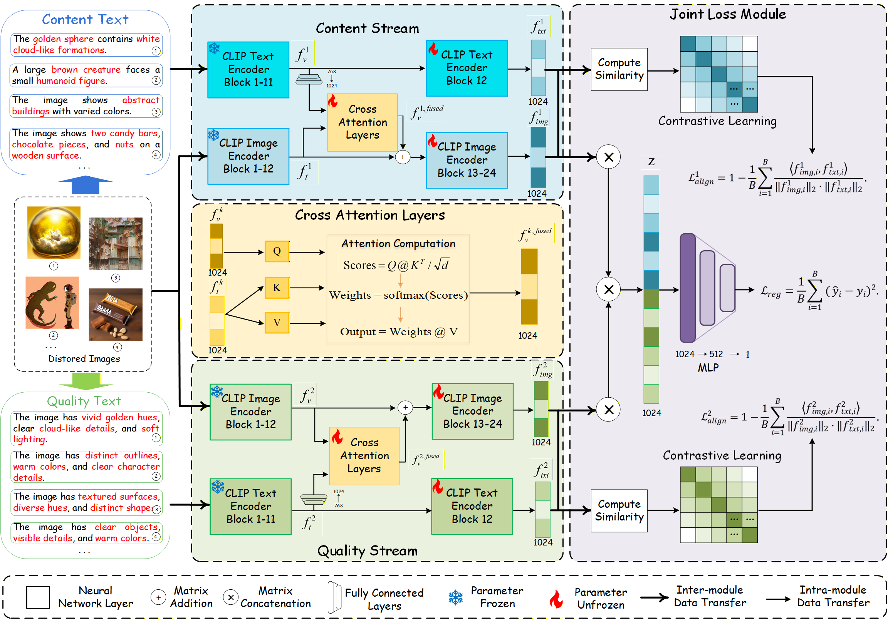
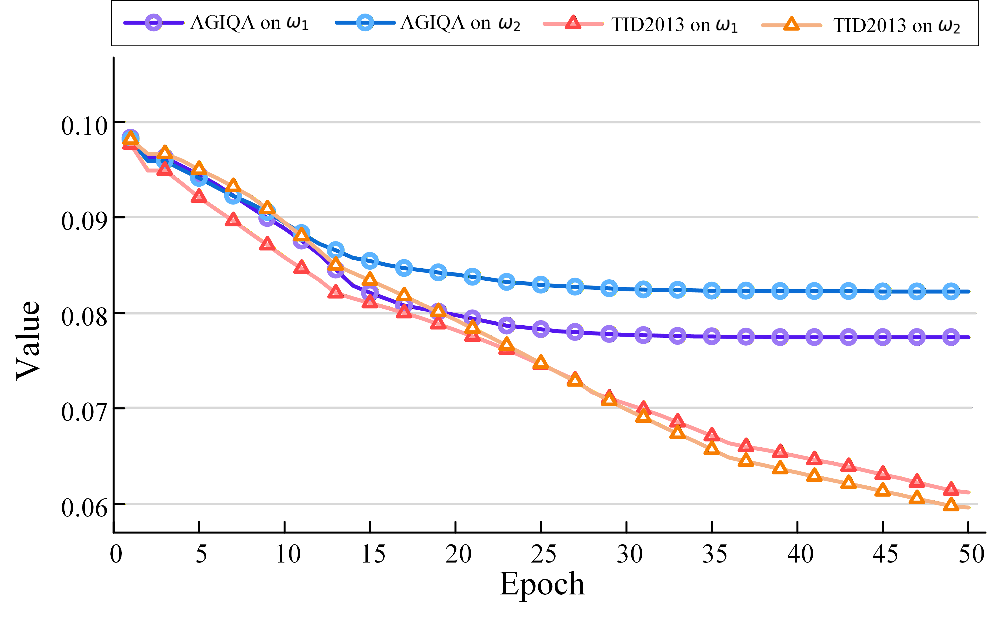
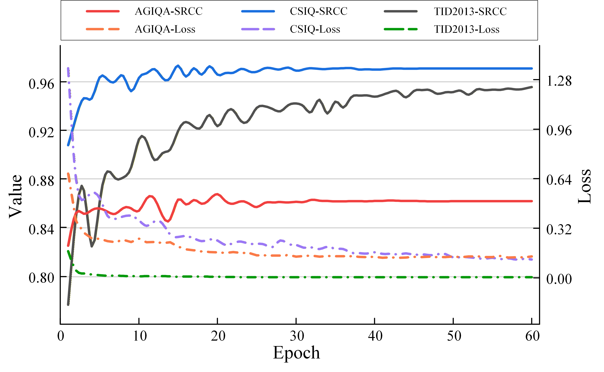
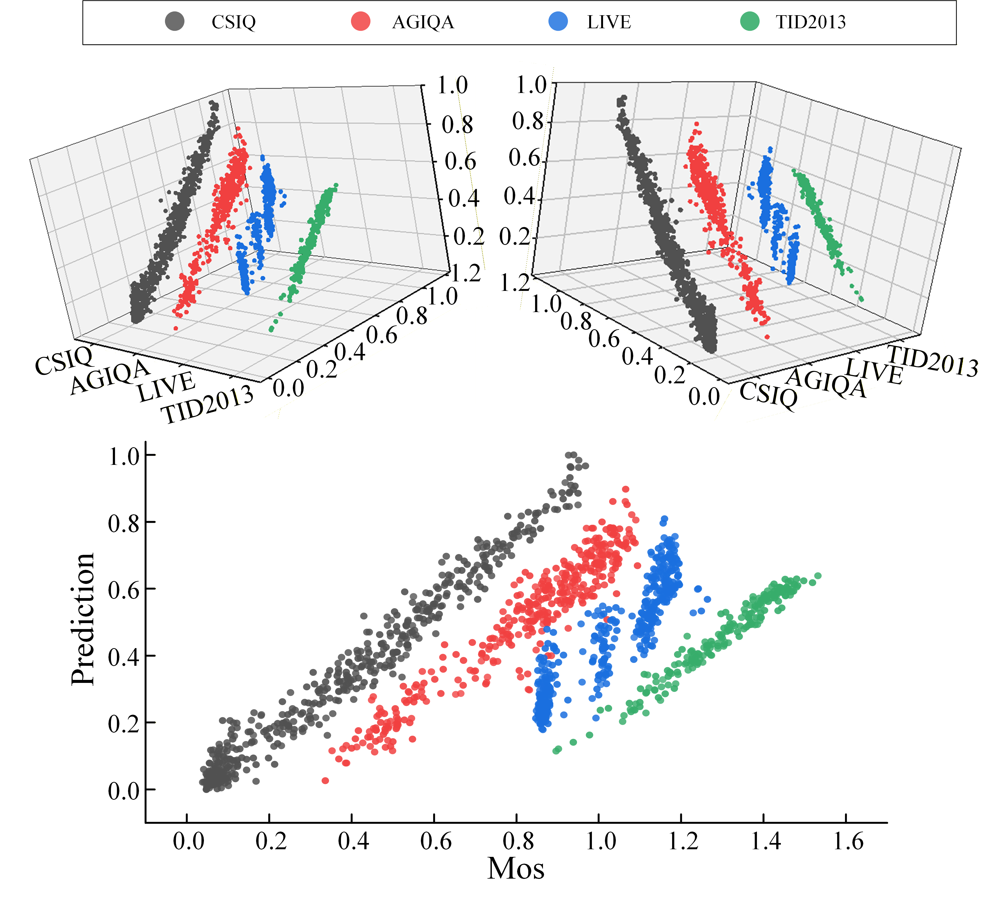

# **Visual-Textual Fusion via Cross-Attention in Dual-Stream CLIP for No-Reference Image Quality Assessment**

## Project Overview

This project implements a deep learning model for Image Quality Assessment (IQA) based on a dual-branch CLIP model and Cross-Attention mechanism. By fusing visual features and text description features, it achieves accurate prediction of image quality.


---

## Directory Structure

```
.
├── iqa_clip_cross_attention.py    # Main model code
├── iqa_clip_cross_attention.md    # This documentation
└── datasets/                      # Dataset directory (text labels only)
└── requirements.txt                
```

---

## Supported Datasets


| Dataset   | Links                                                       |
| --------- | ----------------------------------------------------------- |
| TID2013      | http://www.ponomarenko.info/tid2013.htm     |
| CSIQ      | https://s2.smu.edu/~eclarson/csiq.html |
| AGIQA     |  https://github.com/lcysyzxdxc/AGIQA-3k-Database 
| LIVE      |  https://live.ece.utexas.edu/research/Quality/index.htm 


---

## Evaluation Metrics


| Metric              | Description                 |
| ------------------- | --------------------------- |
| **Spearman (SRCC)** | Measures rank correlation   |
| **Pearson (PLCC)**  | Measures linear correlation |
| **MSE**             | Mean Squared Error          |

## Performance Comparisons

We compare DCLIP-CA with representative no-reference IQA methods on AGIQA-3k, LIVE, CSIQ, TID2013. Metrics: SRCC & PLCC. DCLIP-CA achieves best overall performance and cross-dataset stability.

| Category | Method | AGIQA-3k | LIVE | CSIQ | TID2013 | Mean | Variance |
|:---|:---|:---:|:---:|:---:|:---:|:---:|:---:|
| | | SRCC | PLCC | SRCC | PLCC | SRCC | PLCC | SRCC | PLCC | SRCC | PLCC | SRCC | PLCC |
| Handcrafted | BRISQUE (2012) | 0.541 | 0.497 | 0.929 | 0.944 | 0.812 | 0.748 | 0.626 | 0.571 | 0.727 | 0.690 | 0.0309 | 0.0398 |
| | ILNIQE (2015) | 0.601 | 0.619 | 0.902 | 0.906 | 0.719 | 0.631 | 0.519 | 0.640 | 0.685 | 0.699 | 0.0276 | 0.0191 |
| DNN-based | DBCNN (2020) | 0.815 | 0.875 | 0.968 | 0.971 | 0.946 | 0.959 | 0.816 | 0.865 | 0.886 | <u>0.918</u> | 0.0068 | 0.0030 |
| | HyperIQA (2020) | 0.835 | 0.890 | 0.962 | 0.966 | 0.833 | 0.847 | 0.840 | 0.858 | 0.868 | 0.890 | 0.0040 | 0.0029 |
| | MetaIQA (2020) | 0.510 | 0.546 | 0.960 | 0.959 | 0.942 | 0.923 | 0.868 | 0.856 | 0.820 | 0.821 | 0.0443 | 0.0354 |
| | MUSIQ (2021) | 0.812 | 0.870 | 0.940 | 0.911 | 0.871 | 0.893 | 0.773 | 0.815 | 0.849 | 0.872 | 0.0053 | <u>0.0017</u> |
| | TReS (2022) | 0.836 | <u>0.897</u> | 0.968 | 0.969 | 0.942 | 0.922 | 0.883 | 0.863 | 0.907 | 0.913 | <u>0.0035</u> | 0.0020 |
| | Q-align (2023) | 0.785 | 0.737 | **0.975** | **0.977** | <u>0.961</u> | 0.944 | 0.893 | 0.891 | 0.904 | 0.887 | 0.0075 | 0.0113 |
| | Re-IQA (2023) | 0.818 | 0.879 | 0.970 | 0.971 | 0.947 | <u>0.960</u> | 0.804 | 0.861 | 0.885 | <u>0.918</u> | 0.0074 | 0.0031 |
| CLIP-based | CLIP-IQA (2023) | 0.805 | 0.842 | 0.936 | 0.952 | 0.947 | <u>0.960</u> | <u>0.933</u> | 0.856 | 0.905 | 0.903 | 0.0045 | 0.0039 |
| | LIQE (2023) | **0.864** | 0.675 | 0.970 | 0.951 | 0.936 | 0.939 | 0.898 | <u>0.908</u> | <u>0.917</u> | 0.868 | **0.0021** | 0.0169 |
|  | **Ours (2026)**| <u>0.846</u> | **0.907** | <u>0.974</u> | <u>0.973</u> | **0.982** | **0.984** | **0.956** | **0.963** | **0.940** | **0.957** | 0.0040 | **0.0012** |

> **Note**: Bold = best, underlined = second best.

## Ablation Study

### Dual-stream & Cross-attention

Five configurations on AGIQA-3k, CSIQ, TID2013. Full model (dual-stream + CA) performs best.

<table>
  <thead>
    <tr><th>#</th><th>Content</th><th>Quality</th><th>CA</th><th colspan="2">AGIQA-3k</th><th colspan="2">CSIQ</th><th colspan="2">TID2013</th></tr>
    <tr><th></th><th></th><th></th><th></th><th>SRCC</th><th>PLCC</th><th>SRCC</th><th>PLCC</th><th>SRCC</th><th>PLCC</th></tr>
  </thead>
  <tbody>
    <tr><td>1</td><td>✗</td><td>✓</td><td>✗</td><td>0.736</td><td>0.807</td><td>0.719</td><td>0.799</td><td>0.726</td><td>0.806</td></tr>
    <tr><td>2</td><td>✗</td><td>✓</td><td>✓</td><td>0.825</td><td>0.887</td><td>0.951</td><td><b>0.986</b></td><td>0.923</td><td>0.924</td></tr>
    <tr><td>3</td><td>✓</td><td>✗</td><td>✗</td><td>0.667</td><td>0.766</td><td>0.647</td><td>0.787</td><td>0.760</td><td>0.814</td></tr>
    <tr><td>4</td><td>✓</td><td>✗</td><td>✓</td><td><b>0.857</b></td><td><b>0.912</b></td><td><u>0.972</u></td><td><u>0.982</u></td><td><u>0.944</u></td><td><u>0.952</u></td></tr>
    <tr><td>5</td><td>✓</td><td>✓</td><td>✓</td><td><u>0.846</u></td><td><u>0.907</u></td><td><b>0.980</b></td><td><u>0.984</u></td><td><b>0.956</b></td><td><b>0.963</b></td></tr>
  </tbody>
</table>
### Joint Loss

Comparison of alignment losses. Full joint loss works best.

| # | $\mathcal{L}_{\text{align}}^{1}$ | $\mathcal{L}_{\text{align}}^{2}$ | AGIQA-3k | | CSIQ | | TID2013 | |
|:---:|:---:|:---:|:---:|:---:|:---:|:---:|:---:|:---:|
|   |     |     | SRCC | PLCC | SRCC | PLCC | SRCC | PLCC |
| 1 | ✓ | ✗ | **0.853** | **0.907** | 0.957 | **0.986** | <u>0.935</u> | <u>0.946</u> |
| 2 | ✗ | ✓ | 0.838 | <u>0.880</u> | <u>0.962</u> | 0.979 | 0.931 | 0.942 |
| 3 | ✓ | ✓ | <u>0.846</u> | **0.907** | **0.980** | <u>0.984</u> | **0.956** | **0.963** |

### Learnable Weights

Both weights learnable yields best results.

| # | $\omega_1$ | $\omega_2$ | AGIQA-3k | | CSIQ | | TID2013 | |
|:---:|:---:|:---:|:---:|:---:|:---:|:---:|:---:|:---:|
|   |     |     | SRCC | PLCC | SRCC | PLCC | SRCC | PLCC |
| 1 | ✓ | ✗ | <u>0.843</u> | <u>0.898</u> | <u>0.964</u> | **0.986** | 0.942 | 0.954 |
| 2 | ✗ | ✓ | 0.833 | 0.890 | 0.952 | **0.986** | <u>0.949</u> | <u>0.955</u> |
| 3 | ✓ | ✓ | **0.846** | **0.907** | **0.980** | <u>0.984</u> | **0.956** | **0.963** |
## Parameter Analysis

- **Insertion position $L_v$**: Best at $L_v=12$ (SRCC 0.846 on AGIQA-3k, 0.982 on CSIQ).  
  

- **Learnable weights evolution**: On AGIQA-3k, $\omega_1$ (content) more critical; on TID2013, both balanced.  
  

## Visual Analysis

- **Heatmaps**: Cross-attention focuses on semantically meaningful regions.  
  

- **Loss convergence**: Fast decrease in first 10 epochs, smooth convergence.  
  

- **Scatter plot**: Predicted scores tightly around diagonal, high correlation with ground truth.  
  

---
## Downloading Pre-trained Models

This project uses OpenCLIP pre-trained models. You need to download the model weights before training.

### Using OpenCLIP Library (Recommended)

```python
import open_clip

# Download and cache the model
model, _, preprocess = open_clip.create_model_and_transforms(
    'ViT-L-14-336', 
    pretrained='openai'
)
```

### Manual Download

If you prefer manual download, you can download the `.safetensors` file from the following sources:

| Model | Download Link | File |
|-------|--------------|------|
| **ViT-L-14-336** | [HuggingFace - open_clip](https://huggingface.co/huggingface/open_clip) | `open_clip_pytorch_model.safetensors` |
| **ViT-L-14** | [HuggingFace - open_clip](https://huggingface.co/huggingface/open_clip) | `open_clip_pytorch_model.safetensors` |

After downloading, update the `pretrained` parameter in the code:

```python
pretrained = "/path/to/your/open_clip_model.safetensors"
```

---

## Usage

### 1. Basic Training

```python
from iqa_clip_cross_attention import main

# Train on specified dataset
main(dataset_name="tid2013")
```

### 2. Modify Dataset

Modify the configuration at the beginning of the code:

```python
dataset = "agiqa"  # Options: agiqa, tid2013, csiq, live
```

### 3. Modify Model Configuration

```python
model_this = "my_custom_model"  # Custom model name
epochs = 60                      # Increase training epochs
batch_size = 8                  # Adjust batch size
lr = 1e-4                        # Adjust learning rate
```

---


## Dependencies

```
torch >= 1.9.0
torchvision
open_clip_torch
pillow
pandas
numpy
tqdm
scipy
scikit-learn
matplotlib
```

### Installing Dependencies

```bash
pip install -r requirements.txt
```

---

## Notes

1. **Data Paths**: Ensure dataset paths are configured correctly and image files exist
2. **CLIP Weights**: The pretrained model path should point to a valid `.safetensors` file
3. **GPU Memory**: The ViT-L-14-336 model is large, recommended to use at least 16GB VRAM
4. **Text Column Names**: Different datasets may have different column names, ensure CSV files contain required fields

